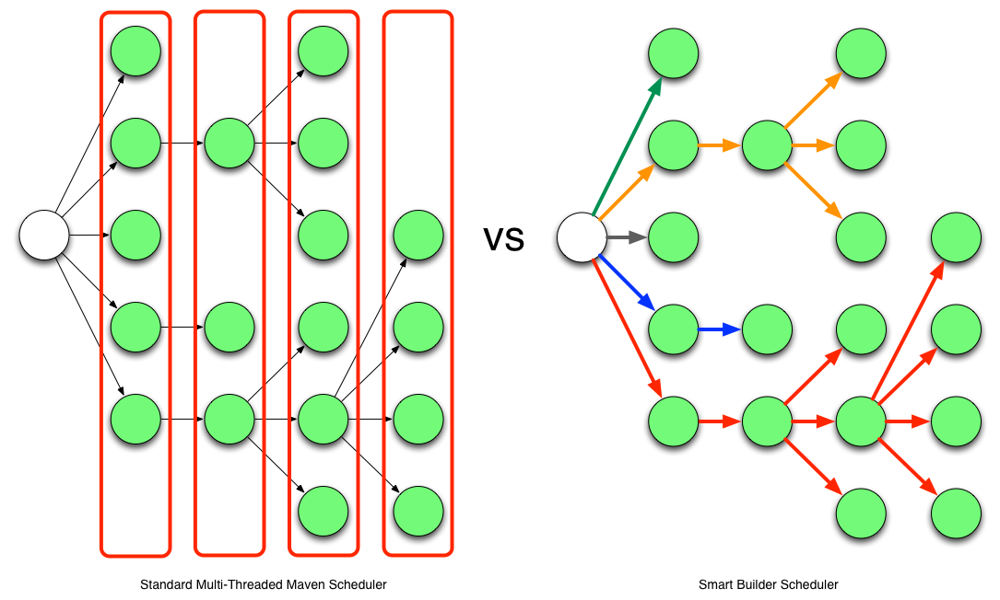

# Using TEAM

The Takari Extensions for Apache Maven bring a number of advantages to your build system. The following sections
detail the configuration and usage.

## Concurrent Safe Local Repository

The local repository used by Maven is, by default, stored in the users home directory in `.m2/repository` . It acts as a
cache for dependencies and plugins, that have been retrieved from remote repositories, as well as a storage location for
build outputs from locally built projects. These can then be used by other Maven projects accessing the local 
repository.

The access to the local repository performed by a standard Maven installation is not designed to support multiple 
instances of Maven or even multiple threads from the same Maven invocation accessing it concurrently. Concurrent access 
can end up corrupting the consistency of the repository due to wrong metadata file content and similar problems.

The Takari concurrent local repository support, available from https://github.com/takari/takari-local-repository,
removes this restriction and enables safe concurrent use of the local repository. Multiple builds and threads can 
concurrently resolve and install artifacts to the shared local repository. This is especially useful for continuous 
integration systems that usually build multiple projects in parallel and want to share the same local repository to 
reduce disk consumption.

Note that this extension is only concerned with the data integrity of the local repository at the artifact/metadata
file level. It does not provide all-or-nothing installation of artifacts produced by a given build.

### Installation and Usage

To use the Takari local repository access, you must install it in Maven's `lib/ext` folder, by downloading the jar
files from the Central Repository and moving them into place:

```
curl -O http://repo1.maven.org/maven2/io/takari/aether/takari-local-repository/0.10.4/takari-local-repository-0.10.4.jar
mv takari-local-repository-0.10.4.jar $M2_HOME/lib/ext

curl -O http://repo1.maven.org/maven2/io/takari/takari-filemanager/0.8.2/takari-filemanager-0.8.2.jar
mv takari-filemanager-0.8.2.jar $M2_HOME/lib/ext
```

Once the extensions are installed, no further steps are required. Any access to the local repository is automatically
performed in a process/thread safe manner.


## Takari Smart Builder

The Takari Smart Builder, available at https://github.com/takari/takari-local-repository, is an alternative scheduler
for build multi-module Maven projects. It allows the user to greatly improve the performance of mulit-module builds. The
primary difference between the standard multi-threaded scheduler in Maven and the Takari smart builder is
illustrated below.




The standard multi-threaded scheduler is using a rather naive and simple approach of using dependency-depth information 
in the project. It builds everything at a given dependency-depth before continuing to the next level.

The Takari Smart Builder is using a more advanced approach of dependency-path information. Projects are
aggressively built along a dependency-path in topological order as upstream dependencies have been satisfied.

In addition to the more aggressive build processing the Takari Smart Builder can optionally record project build times
to determine your build's critical path. If possible, the Takari Smart Builder always attempts to schedule projects on
the critical path first. This means that the timing information is used to determine the longest chain of dependencies
that are forming a chain being built. This chain impacts the overall duration of the build the most. Starting the build
 of the involved projects as early as possible speeds up the overall build the most.

**NOTE: Maven 3.2.1 or higher is required to use this extension.**

### Installation and Usage

To use the Takari Smart Builder you must install it in Maven's `lib/ext` folder, by downloading the jar files from the
Central Repository and moving them into place:

```
curl -O http://repo1.maven.org/maven2/io/takari/maven/takari-smart-builder/0.4.0/takari-smart-builder-0.4.0.jar
mv takari-smart-builder-0.4.0.jar $M2_HOME/lib/ext
```

To take advantage of the Smart Builder you need to use multiple threads in your build execution. Invoke Maven by 
specifying the number of threads to use or the number of threads per core:

```
mvn clean install --builder smart -T8
```

or

```
mvn clean install --builder smart -T1.0C
```

When running builds in parallel, projects download their dependencies just prior to building the project. For
multi-threaded builds, two projects that are built simultaneously and require the same dependency will likely corrupt
the local Maven repository. In order to avoid this problem we recommend using the Takari concurrent safe local 
repository support, which provides thread/process safe access to the local Maven repository.

### Using Critical Path Scheduling

To use the critical path scheduling you simply need to create an `.mvn` directory at the root of your multi-module
project. This directory is used to persist the build timing observed in a `timing.properties` file. If there is no timing
information available the critical path is estimated as the path with the greatest number of segments. On subsequent
runs the timing information is used to calculate the critical path and an attempt is made to schedule that first. Where
possible Smart Builder tries to schedule project builds such that your build should take no longer than the critical
path.

<!--

## Logging

TEAM includes support for colored logging and other features of the [LOGBack logging framework]
(http://logback.qos.ch/) . Colored output can be activated by replacing the
default `M2_HOME/conf/logback.xml` with the included `M2_HOME/conf/logback-colour.xml`


This example configuration simply changes the `[INFO]` label in each log line
toa blue color and the `[WARNING]` label to red. LOGBack supports a lot of
logging configurations, that you can take advantage of. Please refer to the [excellent documentation]
(http://logback.qos.ch/documentation.html) for further details. The [coloring section of the layout chapter]
(http://logback.qos.ch/manual/layouts.html#coloring) is specifically helpful for
further tweaks to the default coloring output e.g. when adapting it to your
favourite command line look and feel.
)

## Improved HTTP Access

TEAM includes usage of the OkHttp Aether Connector for improved performance for
repository access. No user configuration is required to take advantage of this
feature.

-->

